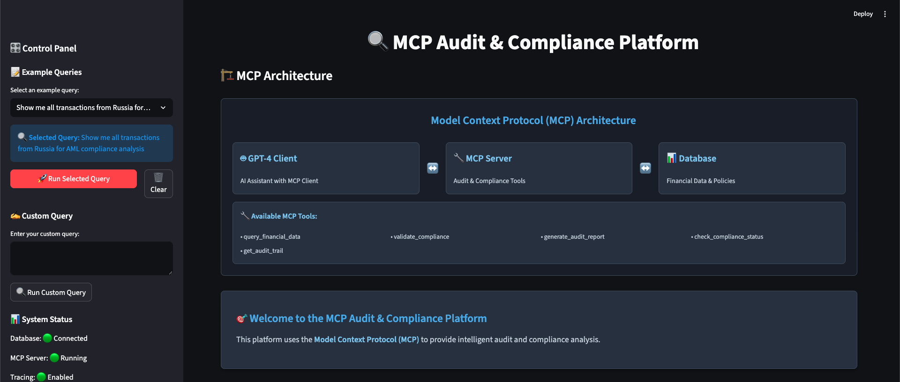
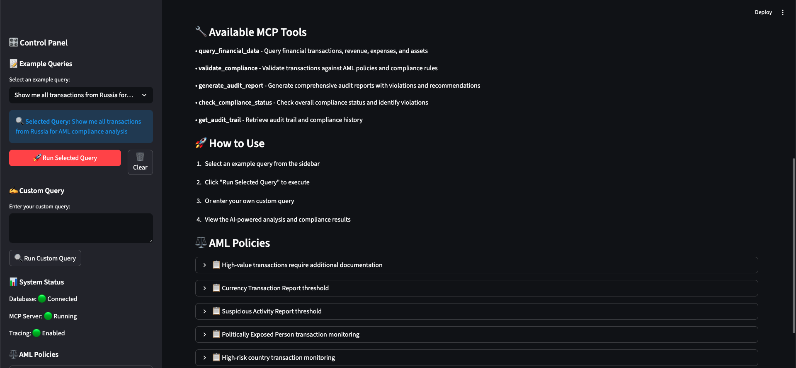
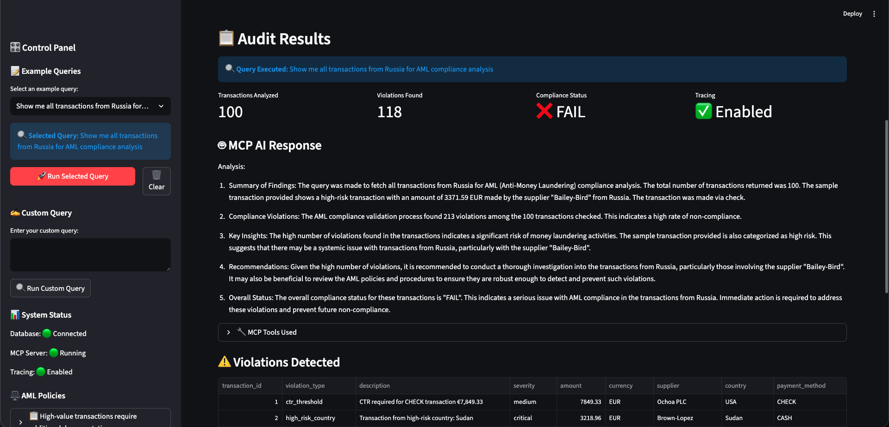
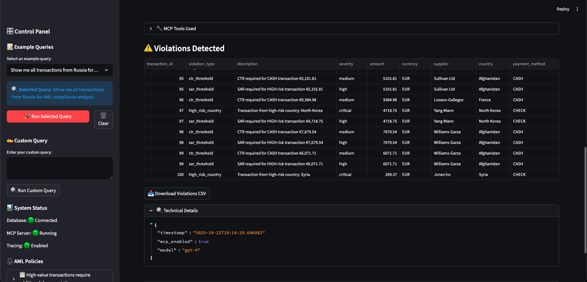
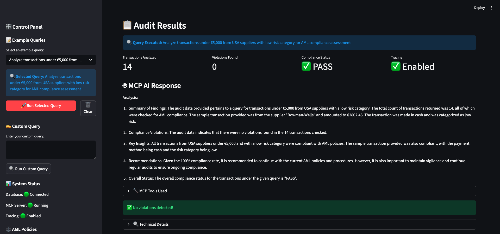

# 🔍 MCP Audit & Compliance Platform

A **Model Context Protocol (MCP)**-based audit and compliance system that provides intelligent financial analysis, AML policy validation, and comprehensive audit reporting using GPT-4 and specialized MCP tools.

## 🏗️ Architecture Overview

```
┌─────────────────────────────────────────────────────────────┐
│                    MCP Server                               │
│  ┌────────────────────────────────────────────────────────┐ │
│  │ • Financial Data Tool (SQLite queries)                 │ │
│  │ • Policy Engine Tool (AML validation)                  │ │
│  │ • Report Generation Tool                               │ │
│  │ • Compliance Checking Tool                             │ │
│  │ • Audit Trail Tool                                     │ │
│  └────────────────────────────────────────────────────────┘ │
└─────────────────────┬───────────────────────────────────────┘
                      │
┌─────────────────────▼───────────────────────────────────────┐
│              🤖 GPT-4 with MCP Client                       │
│  ┌────────────────────────────────────────────────────────┐ │
│  │ • Automatic tool discovery                             │ │
│  │ • Tool execution                                       │ │
│  │ • Response synthesis                                   │ │
│  │ • Error handling                                       │ │
│  └────────────────────────────────────────────────────────┘ │
└─────────────────────┬───────────────────────────────────────┘
                      │
        ┌─────────────┴─────────────┐
        │                           │
┌───────▼────────┐        ┌─────────▼──────────┐
│ 💰 Financial   │        │ ⚖️ Policy Engine   │
│ Data Tool      │        │ Tool               │
│                │        │                    │
│ ┌─────────────┐│        │ ┌─────────────────┐│
│ │ • SQLite    ││        │ │ • AML Rules     ││
│ │ • Queries   ││        │ │ • Validation    ││
│ │ • Analysis  ││        │ │ • Compliance    ││
│ └─────────────┘│        │ └─────────────────┘│
└────────────────┘        └────────────────────┘
```

## 🚀 Key Features

### **MCP Tools**
- **`query_financial_data`** - Query financial transactions, revenue, expenses, and assets
- **`validate_compliance`** - Validate transactions against AML policies and compliance rules
- **`generate_audit_report`** - Generate comprehensive audit reports with violations and recommendations
- **`check_compliance_status`** - Check overall compliance status and identify violations
- **`get_audit_trail`** - Retrieve audit trail and compliance history

### **MCP Resources**
- **`audit://policies/aml`** - AML policies and rules
- **`audit://policies/compliance`** - General compliance rules
- **`audit://schema/database`** - Database schema information

### **Core Capabilities**
- ✅ **Real MCP Implementation** - Uses official MCP SDK
- ✅ **GPT-4 Integration** - Intelligent query processing
- ✅ **Financial Data Analysis** - SQLite-based transaction queries
- ✅ **AML Compliance** - Anti-Money Laundering policy validation
- ✅ **Audit Reporting** - Comprehensive compliance reports
- ✅ **Langfuse Tracing** - Observability and monitoring
- ✅ **Streamlit UI** - Interactive web interface

## 🛠️ Technology Stack

- **MCP Framework**: Model Context Protocol for tool integration
- **AI/LLM**: GPT-4 via OpenAI API
- **Database**: SQLite with SQLAlchemy ORM
- **Backend**: FastAPI with MCP server/client
- **Frontend**: Streamlit web interface
- **Observability**: Langfuse tracing
- **Package Management**: uv

## 📦 Installation

### Prerequisites
- Python 3.11+
- OpenAI API key
- Langfuse credentials (optional)

### Setup
```bash
# Clone the repository
git clone <repository-url>
cd mcp_audit_compliance_platform

# Install dependencies
uv sync

# Set up environment variables
cp env.example .env
# Edit .env with your API keys

# Initialize database
uv run python -c "from src.database import init_database; init_database()"
```

## 🚀 Usage

### Start the MCP Server
```bash
uv run python main.py
```

### Start the Streamlit UI
```bash
uv run streamlit run streamlit_app.py --server.port 8501
```

### API Endpoints
- `GET /` - System information
- `GET /health` - Health check
- `POST /query` - Process audit queries using MCP tools
- `GET /tools` - List available MCP tools
- `GET /resources` - List available MCP resources
- `GET /data/transactions` - Direct database access
- `GET /data/suppliers` - Direct database access

## 🔧 MCP Tools Usage

### Example Queries
```python
# Financial data query
"Show me all transactions from Russia for AML compliance analysis"

# Compliance validation
"Analyze transactions under €5,000 from USA suppliers with low risk category"

# Audit reporting
"Generate a comprehensive AML compliance report for all high-risk transactions"

# Status checking
"Check compliance status for all transactions and identify violations"

# Audit trail
"Generate an audit trail for all compliance violations in the last 30 days"
```

### MCP Tool Schemas
```json
{
  "query_financial_data": {
    "query_type": "transactions|revenue|expenses|assets|suppliers",
    "filters": {"country": "USA", "risk_category": "LOW"},
    "limit": 100
  },
  "validate_compliance": {
    "transactions": [...],
    "policy_type": "aml|financial|regulatory"
  },
  "generate_audit_report": {
    "report_type": "compliance|financial|risk|aml",
    "period": "2024|last_30_days",
    "include_recommendations": true
  }
}
```

## 📊 AML Policies

### High Value Transaction
- **Threshold**: €100,000
- **Severity**: High
- **Rules**: Enhanced due diligence, senior management approval

### CTR Threshold
- **Threshold**: €5,000
- **Severity**: Medium
- **Payment Methods**: CHECK, CASH
- **Rules**: Currency Transaction Report required

### SAR Threshold
- **Threshold**: €3,000
- **Severity**: High
- **Risk Categories**: HIGH, PEP
- **Rules**: Suspicious Activity Report required

### PEP Transaction
- **Threshold**: €1,000
- **Severity**: High
- **Rules**: Enhanced monitoring, additional documentation

### High Risk Country
- **Severity**: Critical
- **Countries**: North Korea, Iran, Syria, Sudan, Cuba, Russia, Belarus
- **Rules**: Enhanced due diligence, additional documentation

## 🔍 Monitoring & Observability

### Langfuse Integration
- **Tracing**: All MCP tool executions
- **Metrics**: Query performance, compliance rates
- **Logging**: Structured logging with context

### Health Monitoring
- Database connectivity
- MCP server status
- MCP client status
- Tool availability

## 🧪 Testing

### Run Tests
```bash
uv run pytest
```

### Test Coverage
- MCP server functionality
- MCP client integration
- Database operations
- API endpoints
- Streamlit UI components

## 📈 Performance

### Benchmarks
- **Query Response Time**: < 2 seconds
- **Database Queries**: < 100ms
- **MCP Tool Execution**: < 500ms
- **GPT-4 Processing**: < 3 seconds

### Optimization
- Database indexing
- MCP tool caching
- Response streaming
- Connection pooling

## 🔒 Security

### Data Protection
- Environment variable encryption
- API key management
- Database access controls
- Audit trail logging

### Compliance
- GDPR compliance
- SOX compliance
- AML regulations
- Audit requirements

## 🤝 Contributing

### Development Setup
```bash
# Install development dependencies
uv sync --group dev

# Run linting
uv run ruff check .
uv run black .

# Run type checking
uv run mypy src/
```

### Code Standards
- Follow PEP 8
- Use type hints
- Write docstrings
- Add tests for new features

## 📄 License

This project is licensed under the MIT License - see the LICENSE file for details.

## 🙏 Acknowledgments

- **Model Context Protocol** - For the standardized tool integration framework
- **OpenAI** - For GPT-4 API access
- **Langfuse** - For observability and tracing
- **Streamlit** - For the web interface
- **FastAPI** - For the backend API

## 📞 Support

For questions, issues, or contributions:
- Create an issue in the repository
- Contact the development team
- Check the documentation

## 📸 Screenshots

### Application Interface

#### Starting Page

*Welcome screen with MCP architecture diagram and example queries*


*Sidebar with AML policies and example query selection*

### Audit Results

#### USA Low-Risk Transaction Analysis

*Analysis of transactions under €5,000 from USA suppliers with low risk category*


*Detailed violation breakdown and compliance status for USA transactions*

#### Russia High-Risk Transaction Analysis

*Comprehensive analysis of Russia transactions showing 213 violations from 100 transactions*

---

**🔍 MCP Audit & Compliance Platform** - Powered by Model Context Protocol & GPT-4